# PROJECT DOCUMENTATION

## Step 1: NGINX INSTALLATION

#### Command: sudo apt update (Packages update in Package Manager)
#### Output:

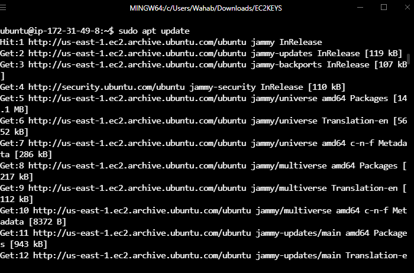

#### Command: sudo apt install nginx (ngnix Installation)
#### Output:

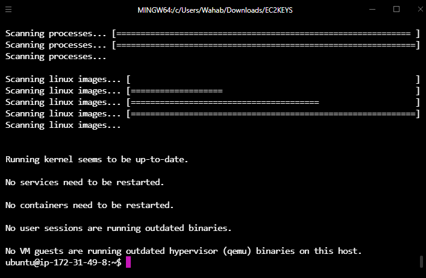

#### Command: sudo systemctl status apache2 (Apache Status Confirmation)
#### Output:

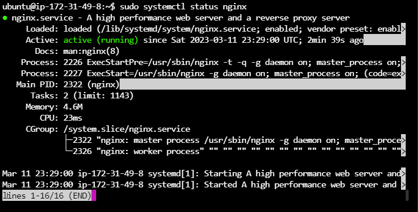

#### Command:  curl http://127.0.0.1:80 (Localhost access via IP)
#### Output:

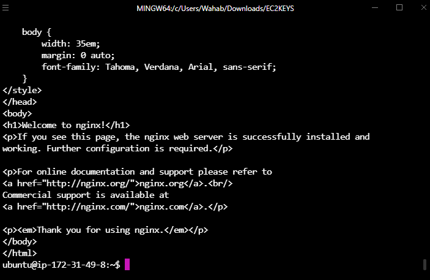

#### Command:  http://54.237.100.243/(Accessing IP address via browser)
#### Output:

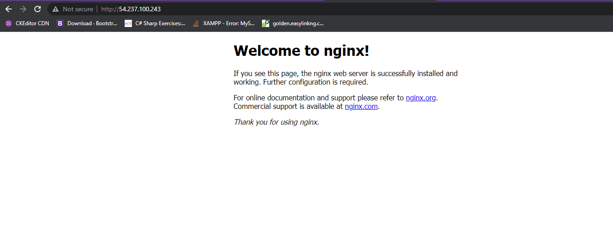

## Step 2: MYSQL INSTALLATION

#### Command: sudo apt install mysql-server (Mysql Installation)
#### Output:

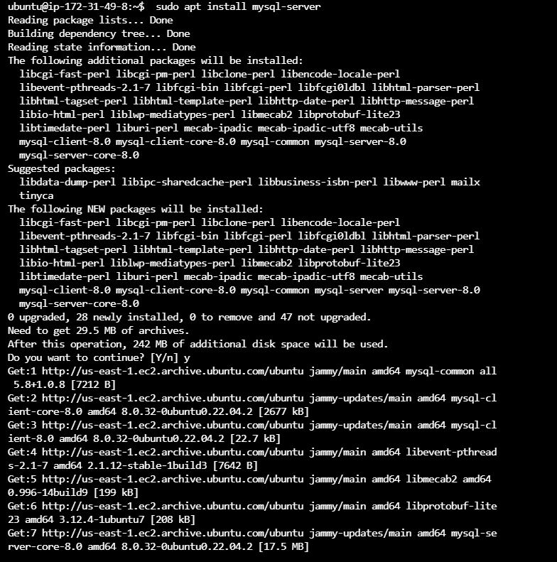

#### Commands: $ sudo mysql and ALTER USER 'root'@'localhost' IDENTIFIED WITH mysql_native_password BY 'PassWord.1'; (connect to mysql and change password)
#### Output:

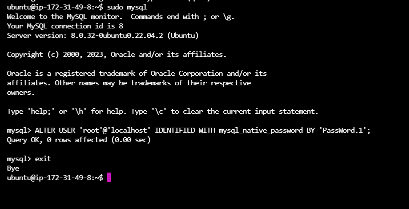

#### Command: $ sudo mysql_secure_installation (Mysql Installation)
#### Output:

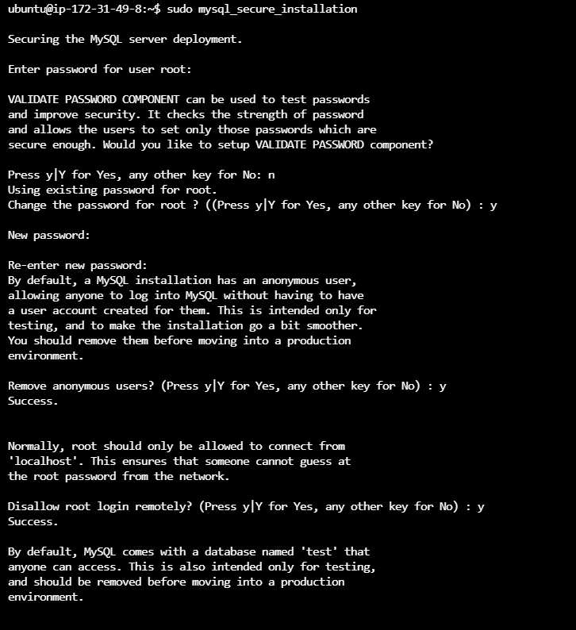

#### Command: $ sudo mysql -p (Login to mysql)
#### Output:

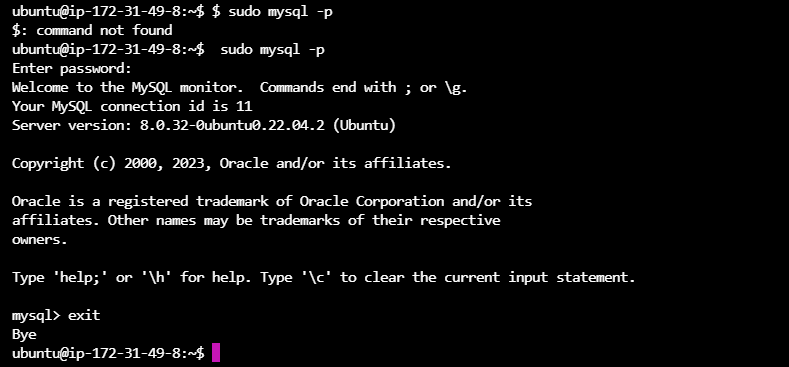

## Step 3: PHP INSTALLATION

#### Command: sudo apt install php-fpm php-mysql
#### Output:

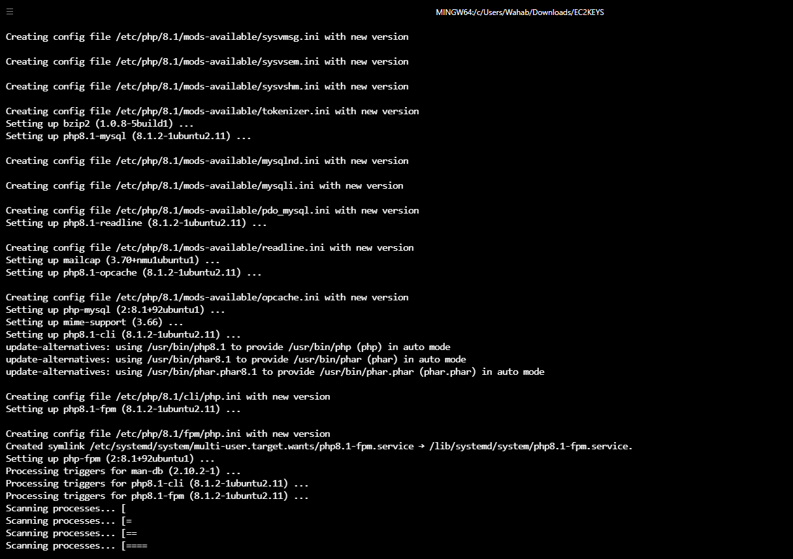

## Step 4: NGINX CONFIGURATION FOR PHP PROCESSOR

#### Commands: sudo mkdir /var/www/projectLEMP and sudo chown -R $USER:$USER /var/www/projectLEMP

#### Output:

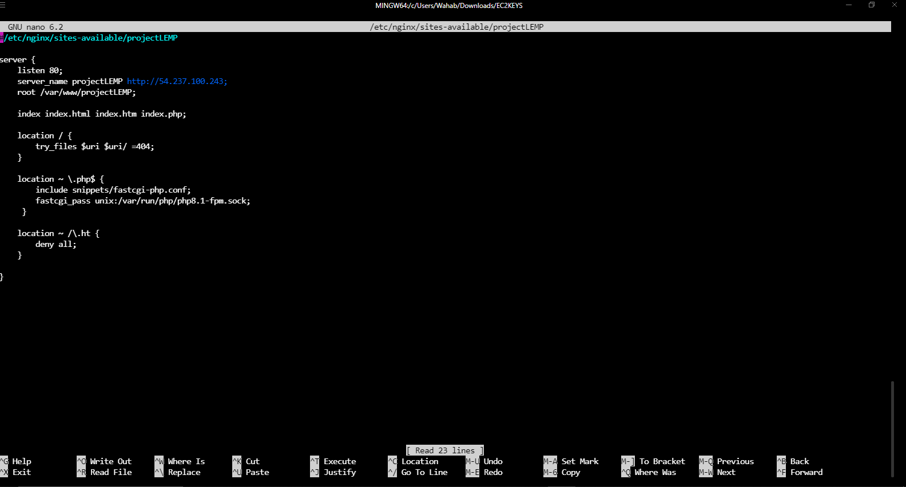

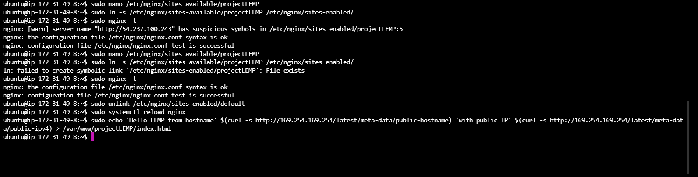

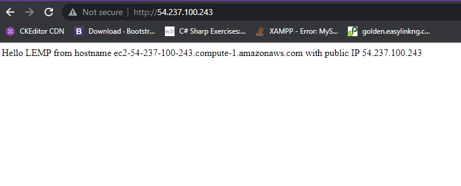

## Step 5: TESTING PHP WITH NGINX

#### Commands: sudo nano /var/www/projectLEMP/info.php (creating info.php file)
#### Output:

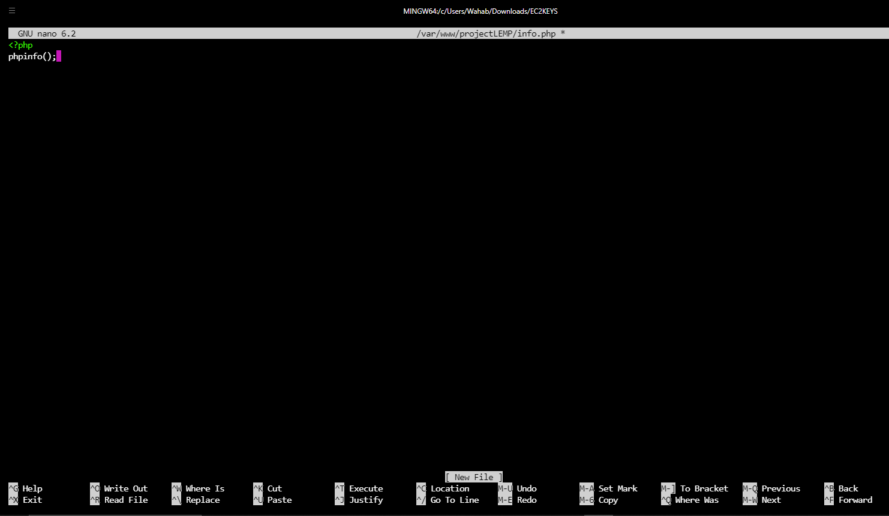

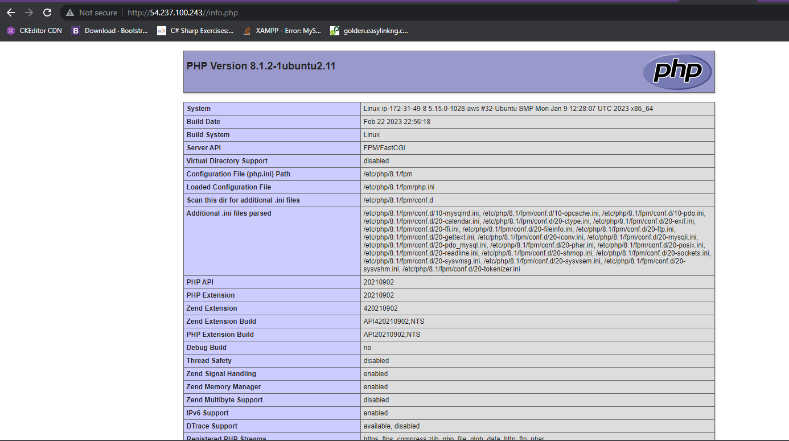

## Step 6: USING PHP TO RETRIEVE DATA FROM MYSQL DATABASE

#### Commands: sudo mysql, mysql> CREATE DATABASE `example_database`; (Log into console, create database, create user access etc )
#### Output:

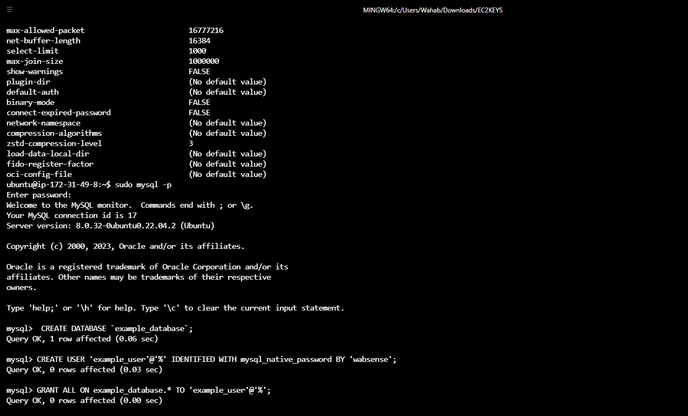

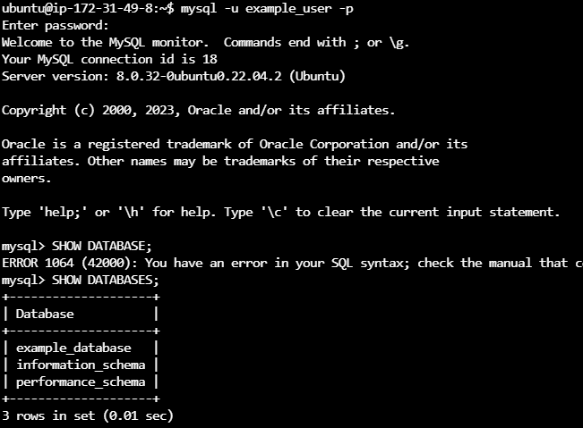

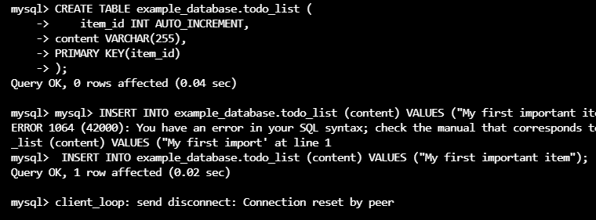

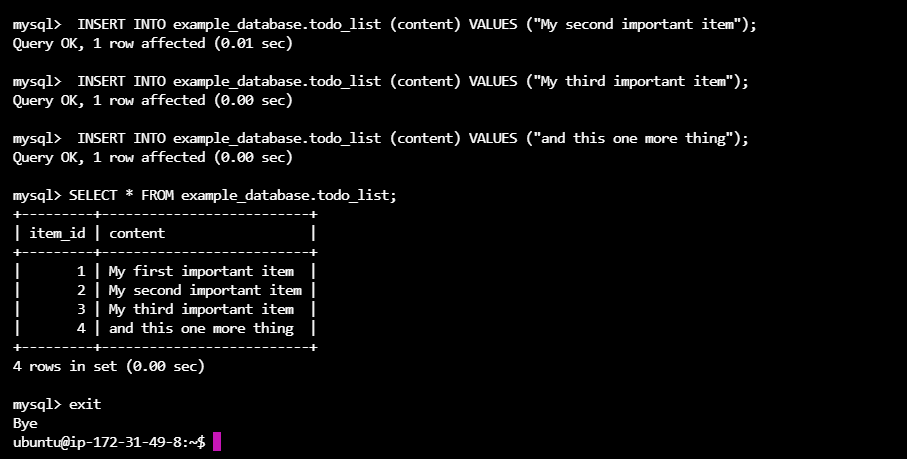

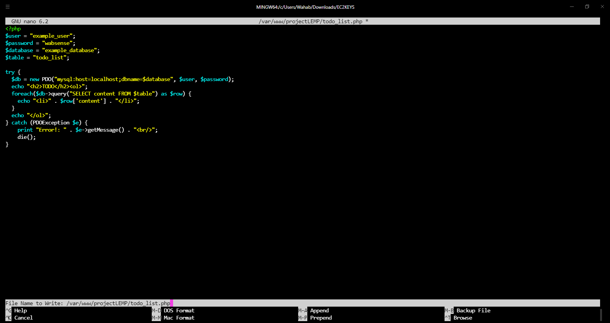

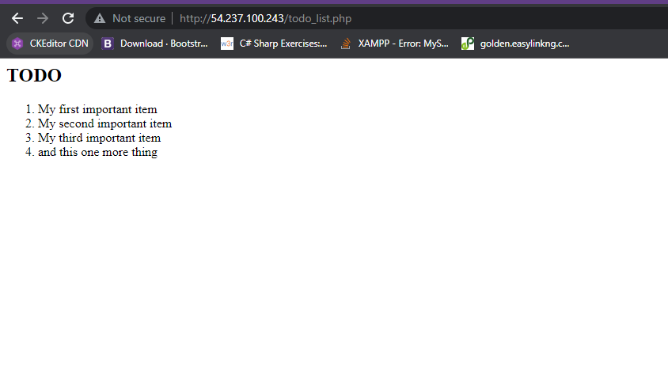

